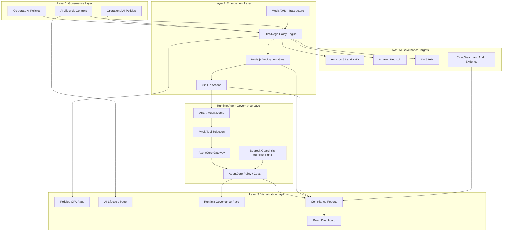
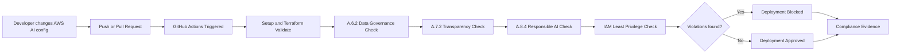
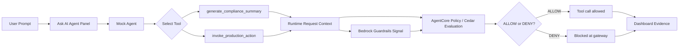
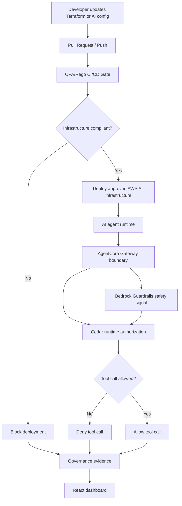
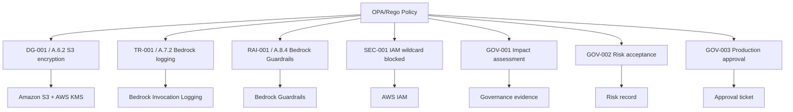
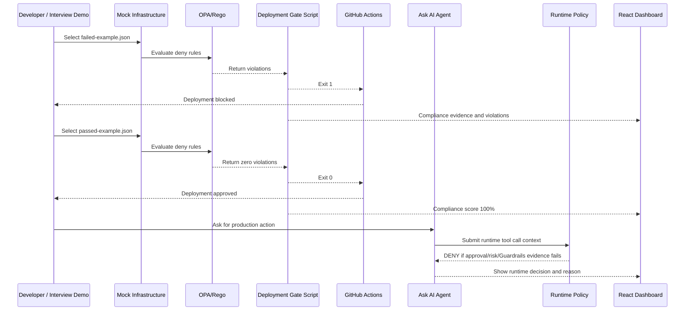

# Architecture Diagram

This project is a Policy-as-Code AI governance platform for AWS AI workloads. It maps ISO 42001-inspired governance requirements to automated OPA/Rego checks, CI/CD deployment gates, runtime agent governance examples, compliance evidence, and dashboard visualization.

## Layered Architecture

## CI/CD Policy Gate Flow

## Runtime Agent Governance Flow

## End-to-End Governance Flow

## Policy Checks

## Demo Flow

